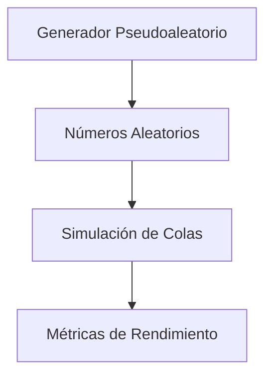

# 📊 Simulador de Líneas de Espera (Sistemas de Colas) con Monte Carlo


Este proyecto es una simulación completa de un sistema de colas (como la fila de un banco o una tienda) utilizando el método de Monte Carlo. El sistema se divide en dos componentes principales:

1.  **Generador de Números Pseudoaleatorios (`SIMULACIÓN-1.py`)**: Crea una secuencia de números pseudoaleatorios de alta calidad utilizando un método congruencial lineal mixto, validando que los parámetros (`x0`, `a`, `c`, `m`) cumplan con las condiciones necesarias para garantizar un período largo y una buena distribución.
2.  **Motor de Simulación (`MONTE CARLO.py`)**: Utiliza los números generados para simular el comportamiento de los clientes. Modela los tiempos de llegada y de servicio basándose en distribuciones de probabilidad extraídas de datos reales (archivos Excel), y calcula métricas clave de rendimiento.

## ✨ Características Principales

-   🔢 **Generador Pseudoaleatorio Avanzado**: Implementa un generador congruencial lineal con validación de parámetros para asegurar la calidad de los números.
-   💿 **Basado en Datos Reales**: Utiliza archivos `xlsx` para definir las probabilidades de los tiempos de llegada y servicio, haciendo la simulación adaptable a cualquier escenario real.
-   🖥️ **Interfaz Interactiva de Consola**: Guía al usuario a través de la configuración de la simulación (cantidad de números, clientes, hora de inicio).
-   📊 **Visualización Clara de Resultados**: Emplea la librería `rich` para presentar todas las tablas de cálculo y los resultados finales de una manera ordenada y fácil de leer.
-   📈 **Cálculo de Métricas de Rendimiento**: Mide y reporta el tiempo promedio de espera, tiempo en el sistema y tiempo de servicio, ofreciendo una visión clara de la eficiencia del sistema.
-   💾 **Exportación de Números**: Guarda los números pseudoaleatorios generados en un archivo `numeros.txt` para su uso en la simulación y para análisis posteriores.

## ⚙️ Flujo del Proceso

El simulador funciona en dos etapas consecutivas:

1.  **Generación de Datos**: Se ejecuta `SIMULACIÓN-1.py`. Este script genera los números pseudoaleatorios necesarios y los guarda en `numeros.txt`.
2.  **Ejecución de la Simulación**: Se ejecuta `MONTE CARLO.py`. Este script lee los números de `numeros.txt`, carga las distribuciones de los archivos Excel y corre la simulación de la línea de espera.



## 🛠️ Instalación

1.  Asegúrate de tener Python 3.8 o superior instalado.
2.  Clona este repositorio o descarga los archivos en una carpeta.
3.  Instala las dependencias necesarias ejecutando el siguiente comando en tu terminal:

    ```bash
    pip install pandas openpyxl rich
    ```

## 🚀 Cómo Usar el Simulador

Sigue estos pasos en orden desde tu terminal.

### Paso 1: Generar los Números Pseudoaleatorios

Ejecuta el script `SIMULACIÓN-1.py`. El programa te pedirá que elijas cómo generar los números.

```bash
python SIMULACIÓN-1.py
```

El script te preguntará si deseas generar por **cantidad** o por **período** y luego guardará los números en `numeros.txt`.

**Importante:** Asegúrate de generar suficientes números. Necesitarás al menos `2 * (número de clientes)` para que la simulación funcione correctamente (un número para el tiempo de llegada y otro para el tiempo de servicio de cada cliente).

### Paso 2: Ejecutar la Simulación de Monte Carlo

Una vez que tengas el archivo `numeros.txt`, ejecuta el script `MONTE CARLO.py`.

```bash
python "MONTE CARLO.py"
```
*(Nota: Usa comillas si tu terminal tiene problemas con el espacio en el nombre del archivo)*.

El script te pedirá:
1.  El número de clientes a simular.
2.  La hora y minuto de apertura del servicio (en formato 24h).

Después de introducir los datos, el programa mostrará todas las tablas de cálculo y la tabla final de la simulación con las métricas de rendimiento.

## 📂 Estructura del Proyecto

```
📦 proyecto-simulacion/
├── 📜 SIMULACIÓN-1.py         # Script para generar números pseudoaleatorios.
├── 📈 MONTE CARLO.py          # Script principal que ejecuta la simulación de colas.
├── 📊 Tiempo_Llegada.xlsx     # Datos de entrada: Frecuencia de tiempos entre llegadas de clientes.
├── 📊 Tiempo_Servicio.xlsx    # Datos de entrada: Frecuencia de tiempos de servicio.
└── 📄 numeros.txt             # Archivo de salida con los números generados.
```

## 📊 Ejemplo de Resultados

La salida final del script `MONTE CARLO.py` incluye una tabla detallada y métricas clave:

#### Tabla Final de Simulación
| CLIENTE | NUM. ALEATORIOS (Llegada) | INTERVALO DE LLEGADA | NUM. ALEATORIOS (Servicio) | INTERVALO DE SERVICIO | HORA DE LLEGADA | HORA DE SERVICIO | HORA DE SALIDA | TIEMPO DE ESPERA | TIEMPO EN EL SISTEMA |
| :---: | :---: | :---: | :---: | :---: | :---: | :---: | :---: | :---: | :---: |
| 1 | 83 | 4 | 24 | 2 | 08:04 | 08:04 | 08:06 | 0.0 min | 2.0 m |
| 2 | 53 | 3 | 99 | 5 | 08:07 | 08:07 | 08:12 | 0.0 min | 5.0 m |
| 3 | 12 | 1 | 38 | 3 | 08:08 | 08:12 | 08:15 | 4.0 min | 7.0 m |
| ... | ... | ... | ... | ... | ... | ... | ... | ... | ... |

#### Métricas Clave Calculadas
-   **Tiempo Promedio Dentro Del Sistema:** El tiempo total promedio que un cliente pasa desde que llega hasta que se va.
-   **Tiempo Promedio De Espera Total:** El tiempo promedio que un cliente pasa en la fila antes de ser atendido.
-   **Tiempo Promedio De Servicio Total:** El tiempo promedio que dura la atención de un cliente.

## 👨‍💻 Autor y Contacto

**Santiago de Jesús Sastre Trejo**

-   **GitHub:** [@69BLACKCAT69](https://github.com/69BLACKCAT69)
-   **Email:** `sosatrejosantiagodejesus@gmail.com`

---

> "La simulación es el arte de comprender sistemas complejos mediante modelos computacionales."
